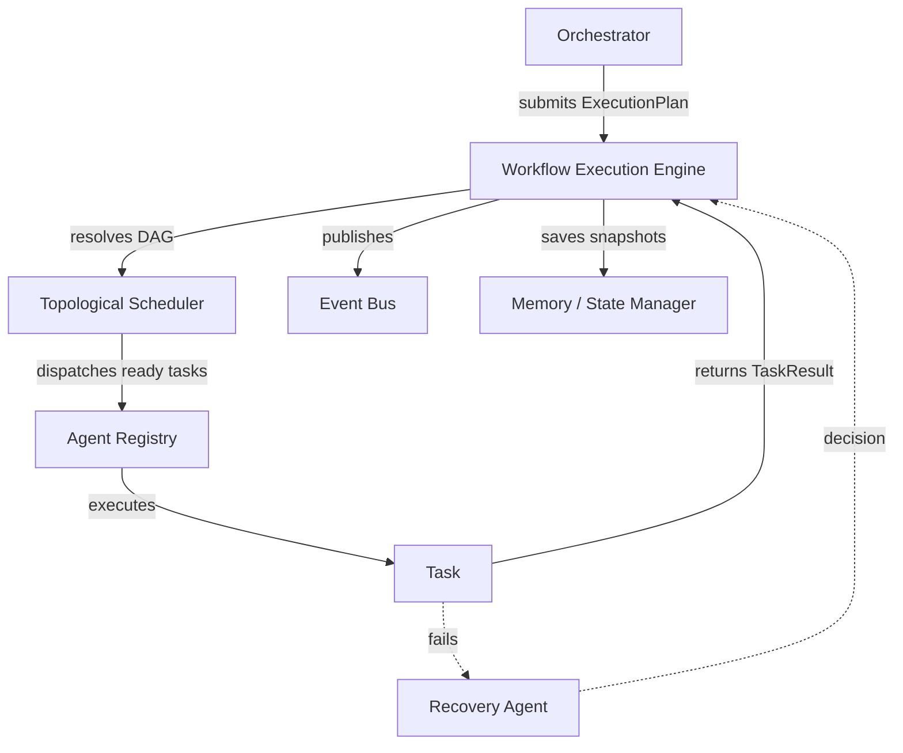

# Workflow Execution Engine

The Workflow Execution Engine is the core runtime responsible for orchestrating, executing, and monitoring workflows generated by the Planner Agent in our autonomous multi-agent Salesforce AI platform. 

It executes tasks defined in an `ExecutionPlan` which forms a Directed Acyclic Graph (DAG), ensuring dependencies are resolved correctly and providing resilience through retries, checkpoints, and automated recovery.

## Architecture

The workflow engine delegates specific tasks to specialized agents (e.g., Salesforce Engineer, Verifier) via an `AgentRegistry`. It continuously publishes lifecycle events using the `EventBus`, allowing other platform services (such as the Orchestrator or Reward & Learning Engine) to react in real-time.



## Key Features

- **DAG Execution Strategy**: The engine parses `ExecutionPlan` tasks and resolves dependencies automatically using a pluggable `TopologicalSchedulingStrategy`. Tasks with met dependencies execute in parallel up to `max_parallel_tasks`.
- **Checkpointing & Persistence**: At every state change, a `WorkflowSnapshot` is created and stored via the `MemoryManager`. If the system crashes, workflows can be reliably resumed from the last checkpoint.
- **Resilience & Recovery**: Failures trigger the `RecoveryAgent`, which can propose a retry with an updated payload, or escalate. The engine applies an exponential backoff configurable via `WorkflowRetryPolicy`.
- **Rollback Operations**: Configurable `rollback_on_failure` triggers inverse tasks for completed steps to ensure the system is left in a consistent state upon escalation.
- **Dynamic Workflows**: Tasks can emit dynamic `generated_tasks` in their output which are appended to the plan and executed at runtime.
- **Conditional Branching**: A task's `metadata` can declare conditions based on upstream output keys, allowing dynamic skipping of downstream nodes.
- **Pausable Execution**: Workflows can be gracefully paused and resumed on demand.

## Usage Overview

```python
from salesforce_ai_engineer.workflow import WorkflowExecutionEngine, WorkflowExecutionPolicy
from salesforce_ai_engineer.agent.models import ExecutionPlan

# Setup dependencies
engine = WorkflowExecutionEngine(
    agent_registry=registry,
    recovery_agent=recovery,
    event_bus=events,
    memory_manager=memory
)

# Execute plan
result = await engine.execute_plan(
    plan=ExecutionPlan(...),
    request="Deploy custom fields to staging",
    policy=WorkflowExecutionPolicy(max_parallel_tasks=5)
)

print(result.status) # SUCCESS, FAILED, ESCALATED
```
